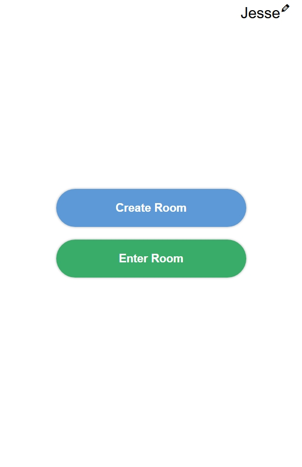
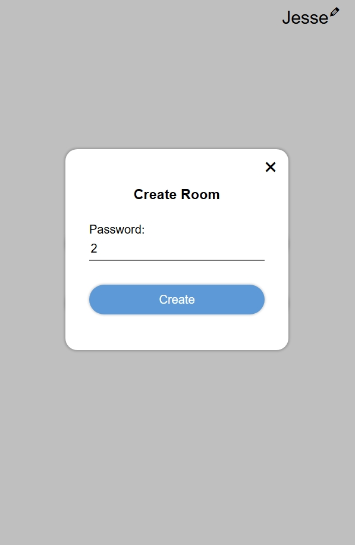
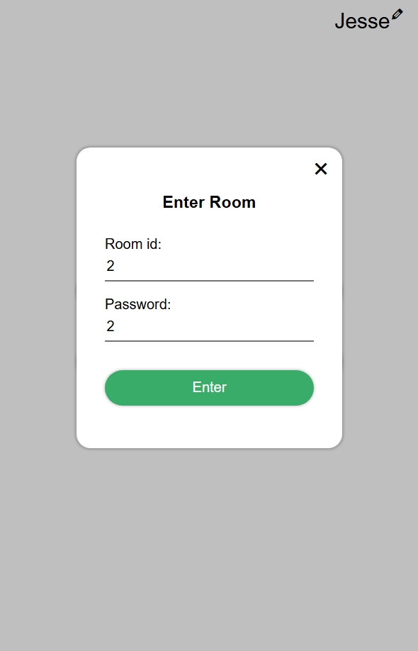
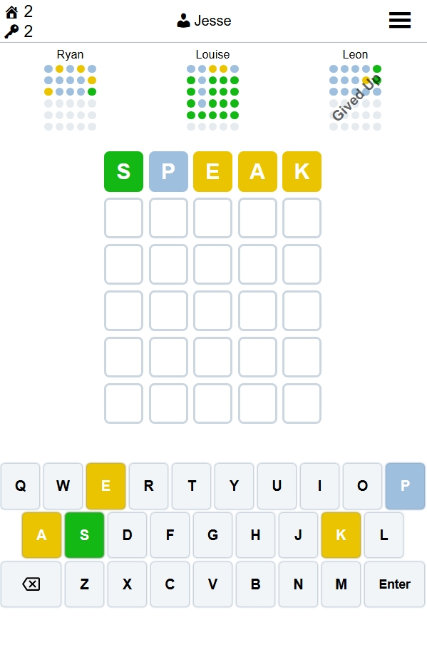
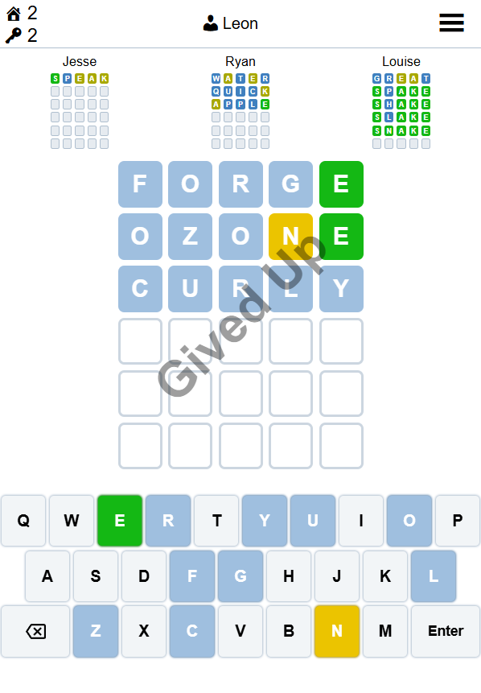
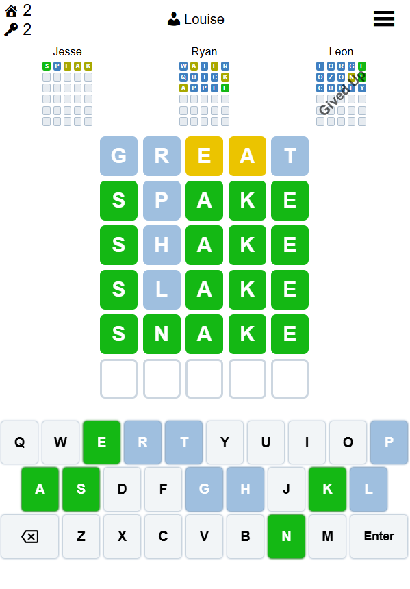
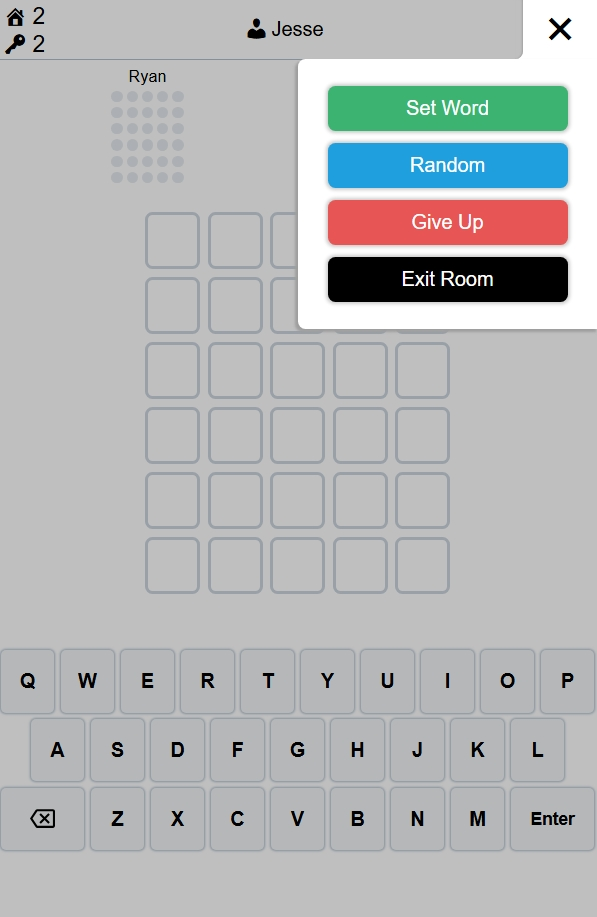
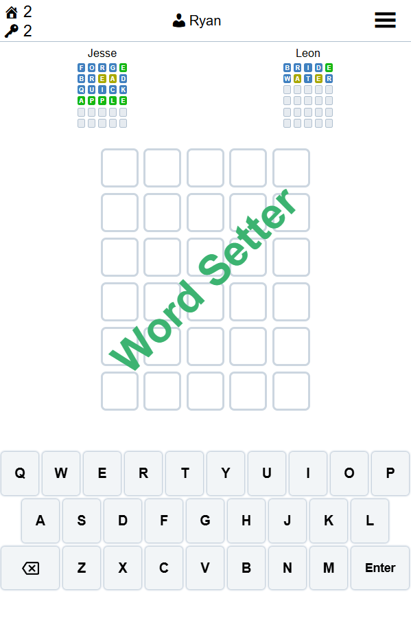
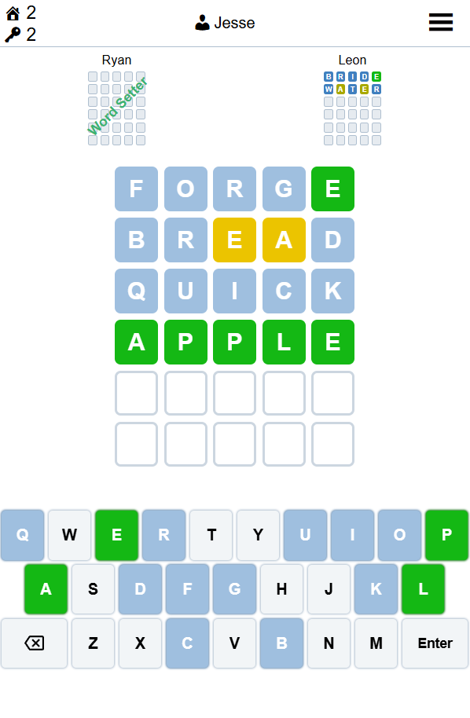
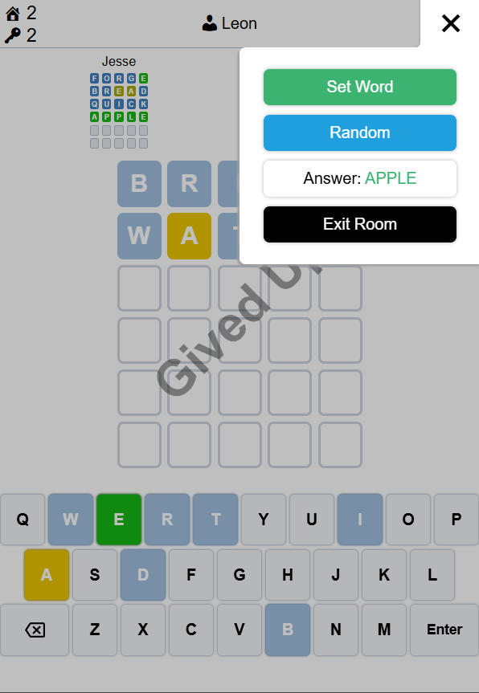

# Online Multiplayer Wordle Game

A **real-time multiplayer Wordle application** that enables multiple players to join the same room, make guesses simultaneously, and view each other’s progress live.
This project demonstrates the integration of **WebSocket-based real-time communication** between a **Spring Boot backend** and a **JavaScript frontend**, providing an engaging and synchronized multiplayer experience.

## Project Overview

The Online Multiplayer Wordle Game allows users to:

* **Create a Room** — Host a private game session with a custom password.
* **Join a Room** — Enter an existing session using a unique room ID and password.
* **Play Wordle Together** — Compete or collaborate to guess the same word in real time.
* **Set a New Word** — Assign a specific word for others to guess or generate a random one to start a new round.
* **Give Up** — Reveal the correct answer.

This system maintains **synchronized game states** across all connected clients, ensuring fairness and consistency during gameplay.

## Technical Highlights

* **Java 23**
* **Backend:** Spring Boot, Maven, STOMP over WebSocket
* **Frontend:** HTML, CSS, JavaScript, STOMP.js
* **Architecture:** Real-time client–server model with live state synchronization
* **Features:** Room-based multiplayer design, responsive interface, dynamic DOM rendering, and efficient event handling

## Team Members

### Ryan Ding

**Contributions:**

* Implemented the **backend logic** using **Spring Boot**, **Maven**, and **STOMP** for WebSocket-based live communication.
* Designed and maintained **real-time game state synchronization** across multiple clients.

### Jesse Shen

**Contributions:**

* Developed the **frontend interface** with **HTML**, **CSS**, and **JavaScript**, integrating **STOMP.js** for bidirectional data updates.
* Contributed to backend logic for **game state management** and **player coordination**.
* Designed a **responsive, interactive UI** with smooth DOM updates and efficient event-driven gameplay.

## How to Run the Program

### Method 1: Using Maven Command Line

1. **Clone the repository:**
   ```bash
   git clone https://github.com/apricore/wordle.git
   cd wordle
   ```

2. **Run the application:**
   ```bash
   mvn spring-boot:run
   ```

### Method 2: Using IDE (IntelliJ IDEA)

1. **Open the project in IntelliJ IDEA**
   - File → Open → Select the project folder

2. **Wait for Maven to download dependencies**

3. **Run the Main class**
   - Navigate to `src/main/java/wordle/demo/Application.java`
   - Right-click and select "Run Application.main()"

## Open and Playing

[http://localhost:8080/](http://localhost:8080/)

## Game Preview

>  
>  
>  
>  
>   
>  
>  
>  
>  
> 
